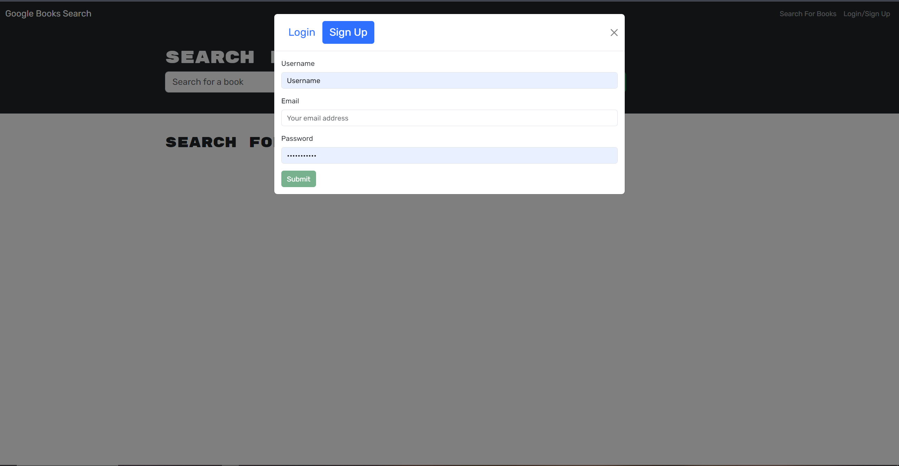

# Challenge-21-MERN

## Website link

- https://miekooooo.github.io/Challenge-21-MERN/ - Pages
-  - Render

## Instructions
1. Run installation 
2. Create a account
3. Search for books

## Description
- Functional book search engine that's easy to use and understand, considering it's simple making it easy to navigate.

- "what was my motivation?" - Needed GraphQL examples
- "why did I build this project?"  - Learn GraphQL more
- "what problem does it solve?" - Missing 2 instead of 3 assignments 
- "what did I learn?" - GraphQL routes

## Features

- Clean Ui / Easy to use
- Google Books Api 
- MongoDB database
- Apollo Server

## Video link 

- https://watch.screencastify.com/v/LS98TfxFIh7lqC6xQLK4

## Screenshots

- 
- 

## Installation

-  "start": "node server/server.js",
   "develop": "concurrently \"cd server && npm run watch\" \"cd     client && npm run dev\"",
   "install": "cd server && npm i && cd ../client && npm i",
   "build": "cd client && npm run build"

## Usage

- Could be used in a library of some sort or a simple book search engine by itself. 

## Credits

- edX
- google

## License 

MIT License

Copyright (c) [2023] [Locket Layne]

Permission is hereby granted, free of charge, to any person obtaining a copy
of this software and associated documentation files (the "Software"), to deal
in the Software without restriction, including without limitation the rights
to use, copy, modify, merge, publish, distribute, sublicense, and/or sell
copies of the Software, and to permit persons to whom the Software is
furnished to do so, subject to the following conditions:

The above copyright notice and this permission notice shall be included in all
copies or substantial portions of the Software.

THE SOFTWARE IS PROVIDED "AS IS", WITHOUT WARRANTY OF ANY KIND, EXPRESS OR
IMPLIED, INCLUDING BUT NOT LIMITED TO THE WARRANTIES OF MERCHANTABILITY,
FITNESS FOR A PARTICULAR PURPOSE AND NONINFRINGEMENT. IN NO EVENT SHALL THE
AUTHORS OR COPYRIGHT HOLDERS BE LIABLE FOR ANY CLAIM, DAMAGES OR OTHER
LIABILITY, WHETHER IN AN ACTION OF CONTRACT, TORT OR OTHERWISE, ARISING FROM,
OUT OF OR IN CONNECTION WITH THE SOFTWARE OR THE USE OR OTHER DEALINGS IN THE
SOFTWARE.